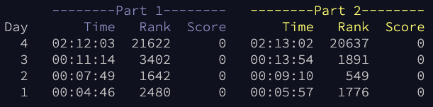

advent of code 2022
===================

https://adventofcode.com/2022

Thanks to [anthonywritescode](https://github.com/anthonywritescode) for this super easy way to grab input.txt and submit the answers to advent of code!

I included a practice run (2021 day 3) in here as well. Modifying support a little to create new utilities.

Going for timed using python and then will attempt in other languages.


### Personal times and global finishes



### timing

- comparing to these numbers isn't necessarily useful
- normalize your timing to day 1 part 1 and compare
- alternate implementations are listed in parens
- these timings are very non-scientific (sample size 1)

```console
$ find -maxdepth 1 -type d -name 'day*' -not -name day00 | sort | xargs --replace bash -xc 'python {}/part1.py {}/input.txt; python {}/part2.py {}/input.txt'
+ python ./day01/part1.py ./day01/input.txt
74
> 1272 μs
```
