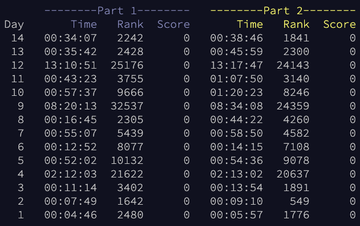

advent of code 2022
===================

https://adventofcode.com/2022

Thanks to [anthonywritescode](https://github.com/anthonywritescode) for this super easy way to grab input.txt and submit the answers to advent of code!

I included a practice run (2021 day 3) in here as well. Modifying support a little to create new utilities.

Going for timed using python and then will attempt in other languages.

### Personal times and global finishes

### golang
I started learning go on 12/3 and i'm using aoc to get a little better with it. the code still feels like i'm creating boilerplate where i maybe shouldn't (lots of `for i, v := range`), so I'm hoping to get some good feedback from experts who have more experience here.

### js
from the home directory:
 - run `npm run test:watch -- day#` to have ongoing test support while working.
 - run `node index.js aoc # --part #` to run with actual values.

### times

There will be a few days (e.g. going out with my wife) where I am unable to compete at 9pm PT. So, instead, I'm including creating the folder and using the created time of `__init__.py` as my start time.
 - day 4: Started @ 2:04:22, so `part1 = 00:07:41 and part2 = 00:08:40`